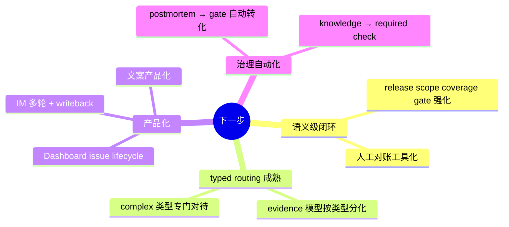

# 06 · 收获与边界 — 诚实的总结

> 为什么读这篇：前面五篇都在讲"做成了什么"，这篇讲"学到了什么"和"没做好什么"。
> 读完带走：三个最值钱的收获 + 五个明确的局限 + 下一步方向。

## 三个最值钱的收获

### 收获 1：把"治理"当成产品来做，而不是当成开销

做这个项目之前，我以为门禁、契约、evidence、postmortem 这些是"为了交付质量不得不做的事"——是开销。做完之后我的认知彻底反转：**治理本身就是产品。**

证据是：这个项目最能拿出来说的东西，没有一个是"功能"——
- 21 篇 postmortem 是治理产物，不是功能。
- S0–S4 门禁是治理结构，不是功能。
- Evidence v0.6 / FKC 分层 / PEG 是治理机制，不是功能。
- [[03-可迁移法则]] 那 10 条是治理经验，不是功能。

**一个 Agent 项目的护城河不在能力面（能力会被模型碾压），在治理面和运行态面。** 这是我做这个项目最大的认知转变。简历上如果只能写一句话，我会写这句。

### 收获 2：组织项目的方式本身就是产品的同构物

这条是 [[03-可迁移法则]] 法则 7 的延伸，也是我个人最珍惜的洞察。

我发现我在用治理 Agent 的方法治理"开发 Agent 的过程"：
- builder / executor / monitor / 外部 reviewer 的角色分离，对应 Agent 的 actor contract。
- 拿 evidence 包来评审，对应 Agent 的"只看 RAW 工件"。
- 把裁定写回 contract，对应 Agent 的"决策写回契约"。
- postmortem 沉淀成 gate，对应 Agent 的"学习变成 required check"。

**这不是巧合——因为治理一个会犯错的 AI 和治理一个会犯错的开发流程，本质是同一个问题：怎么把不可信的执行约束成可验证的交付。** 这个元技能比任何单条代码都值钱，而且它可以迁移到任何 Agent 项目之外的场景（团队管理、流程设计、系统架构）。

### 收获 3：诚实是最大的成熟度信号

这个项目里有几处"主动声明自己没完成"的地方：
- v1.0-rc.1 release notes 第一句："It is **not GA** and does **not** mean production deployment is complete."
- PM-018 之后把 hooks 定义为"必要但远远不充分"。
- capability map 里每个能力都标了诚实成熟度（🟢/🟡/🔵），不回避缺口。
- finalize gate 即使全过，也明确不等于"release 质量可靠"。

**这种诚实不是谦虚，是工程纪律。** 一个会主动声明自己边界的系统，比一个声称"全链路自动化、零人工干预"的系统可信得多。因为前者你能预测它在哪里会失败，后者你不知道它在哪里撒谎。

## 五个明确的局限

我不想把这个项目包装成银弹。它有五个明确的局限，每个我都承认：

### 局限 1：压不住"语义级漏项"

PM-018 那种"Hive + SR mirror 但只交了 SR DDL"，需要 release scope coverage gate 配合人工对账。目前是"必要不充分"——机器能对账"发布范围写明的对象"，但对不了"业务语义上是否完整"。

**这意味着什么**：finalize gate 全过，仍不能替代人工复核。AI 能做到"形式上没漏"，做不到"语义上完整"。

### 局限 2：Typed routing 还年轻

三种需求类型（standard / complex / diagnostic）的 gate 解释已经分叉，但 evidence 模型还没完全按类型分化。也就是说，一个 diagnostic 类型的需求，目前走的 evidence 模型和 standard 类型差别不够大。

**这意味着什么**：简单需求和复杂需求目前共享太多逻辑，复杂需求没有得到应有的专门对待。

### 局限 3：产品化未完成

这套工程内核很强，但外壳还不够"给非工程师用"：
- IM review 多轮、writeback 是 MVP。
- Dashboard 是 MVP，issue lifecycle 闭环未完成。
- 用户可见文案需要产品化打磨。

**这意味着什么**：目前这个系统主要还是给"懂工程的数据开发者"用，不是给业务方用。

### 局限 4：线上操作永远归开发者

agent 只拥有 release package；线上调度修改、执行、验收是开发者的责任。

**这不是待补的缺口，是有意的边界**——但对外宣讲时容易被误解为"做不到全自动化"。实际上这是 [[07-什么是Agent与研究笔记]] 要素 4 的落地：高风险动作必须 approval-gated，agent 不静默执行线上变更。

### 局限 5：场景依赖性强

[[03-可迁移法则]] 那 10 条法则有一个共同前提：**场景容不容得下"形式合规地撒谎"。** 如果场景是 demo、是 happy path、是容错率极高的玩具，这套治理就是过度工程。

**这意味着什么**：这套设计不能照搬到所有 Agent 项目。它只在交付出错有真实代价的工业现场才成立。

## 下一步方向

基于 gaps-and-roadmap 和我对项目的判断，下一步的重点是：

其中我最想推进的是"**postmortem → gate 的自动转化**"——目前 21 篇 PM 沉淀成了法则和文档，但只有一部分转化成了强制 gate。如果能让"每篇 high severity PM 自动产出一个 regression test 或 gate"，这个项目的治理闭环才算真正合上。

## 如果重新做一次，会改变什么

诚实地说，有三个地方如果重做会调整：

1. **更早引入 runtime spine**。runtime（run_id / timeline / checkpoint）是 v0.9 才有的，但前期的很多事故（PM-003 的"叙述冒充证据"、PM-008 的"中间状态被篡改"）如果有 runtime 会更容易发现。如果重来，runtime 会从 v0.1 就埋进去。

2. **分类系统从第一天就封闭起步**。早期 `finding_kind` / `check_type` 这些字段经历了"随便填 → 杂物抽屉 → 推翻重来 → 封闭起步"的弯路。如果重来，[[03-可迁移法则]] 法则 8 从第一天就执行。

3. **把"门禁过 ≠ 交付对"的认知前置**。PM-018 的教训来得太晚——在那之前我对 hooks finalize 的信任度过高。如果重来，门禁从第一天就被定义为"必要不充分"，会少走很多弯路。

## 一句话总结整个案例集

如果要把这七篇压成一句：

> **demands_agent 不是"让 AI 更能干"的项目，是"让 AI 的不可信变得可验证、可拦截、可恢复"的项目。它的产出不是代码，是一套把不可信约束成可交付的工程纪律——而这套纪律，比任何单条代码都更值得迁移到下一个 Agent 项目。**

---

上一篇：[[05-演进史]] ｜ 下一篇：[[07-什么是Agent与研究笔记]]
