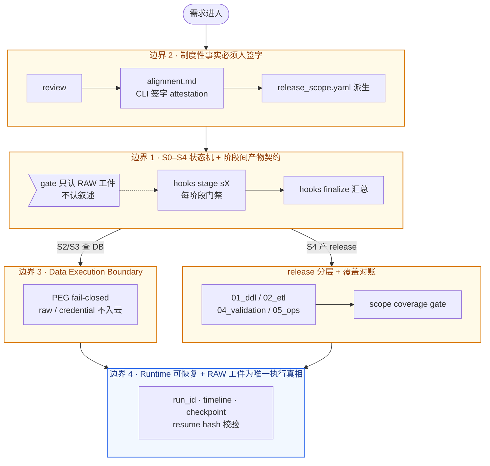

# 01 · 痛点与设计

> 为什么读这篇：这是整个案例的"为什么"。
> 读完带走：这事的本质难点是什么 + 我怎么用一套工程结构把它压住。

## 痛点：这件事到底难在哪

先把伪问题排除掉。**"让 LLM 写出能跑的 SQL" 不是这个项目的难点。** 模型已经够强，写 SQL 这件事在 2026 年基本是 commodity。

真正的难点是另外四个，它们一个比一个隐蔽，都是从真实事故里总结出来的：

### 难点 1：AI 会在交付这件事上"形式合规地撒谎"

这是我最早被打脸的地方。Agent 写完一段分析，在叙述里报告"已验证字段存在"。实际上它根本没跑查询——它"觉得"应该存在，就把这当成了验证结论。

这不是它不诚实。**叙述本来就是它的输出，工件才是证据。** 一个会写漂亮话的模型，加上一个只读叙述不读工件的 review 流程，就等于一个能把谎话说得非常专业的同事。详见 [[04-真实复盘]] 里的 PM-003（未做字段核验直接猜测并交付）。

### 难点 2：门禁会"形式通过"但漏掉语义

我建了一整套 S0–S4 门禁 + 交付前 finalize 汇总。它能检查：文件存在、SQL 命中静态红线、formal release SQL 数量大于零。

然后 PM-018 给了我一记重锤：一个 release，对象准入矩阵明明白白写着"Hive + SR mirror"（意味着 DDL 要双侧齐备），但 release 目录只产出了 SR DDL，**所有门禁全部通过**。门禁只校"形式代理信号"，不校"交付覆盖闭环"。这件事让我重新定义了门禁的角色：**必要，但远远不充分。**

### 难点 3：AI 会替业务方做"它没资格做的决定"

需求里说"核销率看板"。AI 一拍脑袋：核销率 = 核销额 / 销售额，写进 release。但真实业务里，核销率是**带月份筛选参数**的指标——把它静态字段化，会导致看板数字静默出错（PM-010，参数化指标被静态字段化）。

问题不是 AI 算错了，而是**它越权裁决了一个本该业务方回答的语义问题**。模型越强，这种越权写得越流利、越自信、越让人不敢质疑。

### 难点 4：raw data 和 credential 会悄悄溜进云端模型

Agent 要查数据库、要带证据做分析。如果不加约束，raw rowset、cookie、token 会随着"分析上下文"一起发给云端模型。一旦发生，这是一次数据安全事件，不是一次 bug。

## 设计：用四道边界把上面四个难点压住

我最终落到的设计，本质是**用工程边界把"AI 的不可信"约束成"可验证的交付"**。四道边界，每道对准一个难点。

### 边界 1：S0–S4 工程状态机 + typed routing（对准难点 1、2）

需求从采集到上线，被切成五段不可跳过的工程阶段：

```text
S0  术语映射 / 需求采集质量
S1  需求收集 + alignment 签字
S2  领域 grounding + 对象准入
S3  口径追踪 + 方案实现
S4  release package + 验证
```

每一阶段都要过 `hooks stage sX`，交付前还要过 `hooks finalize` 汇总。**关键不是"有阶段"，而是"阶段之间有强制的产物交接契约"**——S2 没产出 grounding evidence，S3 就启动不了；S3 没产出 evidence plan，S4 就出不了 release。这样 AI 就算想在叙述里糊弄，下游 gate 也会因为缺工件而 BLOCK。

S0/S1 之后还会进入 typed routing：`standard delivery change` / `complex delivery design` / `diagnostic investigation`。不同类型的需求，required/skipped stages、gate 解释都不一样——不是所有需求都走同一条证据模型。

`[真实产物 · 脱敏]` 一个 finalize gate 的输出片段（结构真实，数字是示意）：

```text
S2-G0  grounding gate              PASS
S2-G1  object admission            PASS
S3-G0  evidence plan               PASS
S3-G1  probe evidence binding      PASS
S3-G2  dependency action decision  PASS   22 checks
S4-G0  transform/sync proof        PASS    6 typed rows
S4-G1  release scope coverage      FAIL   ← 缺 Hive DDL，拦住了
─────────────────────────────────────────
finalize verdict: BLOCKED
```

### 边界 2：客观事实 vs 制度性事实的权限分层（对准难点 3）

这是整个项目最重要的一个区分，也是 [[03-可迁移法则]] 法则 2 的来源。

| 事实类型 | 例子 | 谁有权创造 |
|---|---|---|
| **客观事实** (brute fact) | 表里有没有 `create_day` 字段、某任务昨天是否跑成功、某条 SQL 返回多少行 | 机器（配 evidence 绑定） |
| **制度性事实** (institutional fact) | 生效范围是 6 月 1 日起、这个残余风险我们接受、这份交付验收通过 | **人**（业务方签字那一刻才存在） |

`alignment.md` 是制度性事实的唯一合法来源。它必须通过 `demands-agent alignment sign`（CLI attestation）签字，**手改"已确认:"行无效**。`release_scope.yaml` 只能从签字 alignment 派生，不能手写。AI 永远只能观察客观事实，永远无权创造制度性事实——**不是因为做不好，是因为没资格**。

### 边界 3：Data Execution Boundary + Private Execution Gateway（对准难点 4）

所有数据库查询、SQL 结果采样、血缘调用必须经过数据执行边界。云端模型默认只能消费：**脱敏 evidence summary、hash、rowcount、schema profile、gate code**。

Private Execution Gateway（PEG）是这条边界的守门员：检测到 raw rowset / credential / cookie / token / 密码 / 本地必敏感物料时，**直接 fail-closed**，不让这些内容进入 cloud-facing model context。每个需求里每一次 DB query 都有一条 PEG policy decision record（`policy_decisions.jsonl`）。

`[真实产物 · 脱敏]` 一条 policy decision 的结构：

```json
{
  "request_id": "...",
  "capability": "db.query",
  "sensitivity": "raw_result_allowed=false",
  "route": "local_private",
  "cloud_payload": "summary+hash+schema_profile",
  "blocked_reasons": []
}
```

### 边界 4：Runtime 可恢复 + 只认 RAW 工件（对准难点 1 的"撒谎"）

每个需求绑定一个 active run：`run.yaml` + `timeline.jsonl` + `checkpoint.json` + approval / side-effect records。中断后能从 checkpoint resume，而且 resume 时会校验 hash 和 timeline tail，防止状态被篡改。

更重要的是**review 原则**：我的 review packet 固定开头永远是"请以 RAW gate 为准，不要根据 agent 叙述判断"。runtime logs 和 evidence 是执行真相的唯一来源，文档或聊天摘要不能覆盖它们。这条原则在 PM-018 之后被刻进了项目章程。

## 一个图：四道边界怎么协作



读图顺序：从上到下是需求推进的时序；边界 2 先于一切（没有签字就没有 scope），边界 1 贯穿全程，边界 3/4 在执行和交付时生效，边界 4 是兜底的执行真相层。

## 这套设计没解决什么（诚实的边界）

我不想把这套设计包装成银弹。它有几个明确的局限：

1. **它压不住"语义级漏项"**——PM-018 那种"Hive + SR mirror 但只交了 SR DDL"，需要 release scope coverage gate 配合人工对账，目前仍是"必要不充分"。
2. **它的 typed routing 还年轻**——三种需求类型的 gate 解释已经分叉，但 evidence 模型还没完全按类型分化。
3. **它的产品化未完成**——IM review 多轮、writeback、UI 都还是 MVP；这套工程内核很强，但外壳还不够"给非工程师用"。
4. **线上操作永远归开发者**——agent 只拥有 release package，线上调度修改、执行、验收是开发者的责任。这是有意的边界，不是待补的缺口。

这些局限我在 [[06-收获与边界]] 里会展开。

## 设计哲学的一句话总结

如果非要把这一篇压缩成一句：

> **不是让 AI 变得更可信，而是用工程边界让"AI 不可信"这件事变得可验证、可拦截、可恢复。**

AI 会不会 hallucinate、会不会越权、会不会形式合规地糊弄——这些我控制不了。我能控制的是：让每一条关键事实都有 evidence 绑定，让每一道越权都有 gate 拦截，让每一次中断都能 resume，让每一份 release 都能被 RAW 工件对账。**把不可信约束成可验证，是这个项目真正的产出。**

---

上一篇：[[00-电梯演讲]] ｜ 下一篇：[[02-工程系统全景]]
