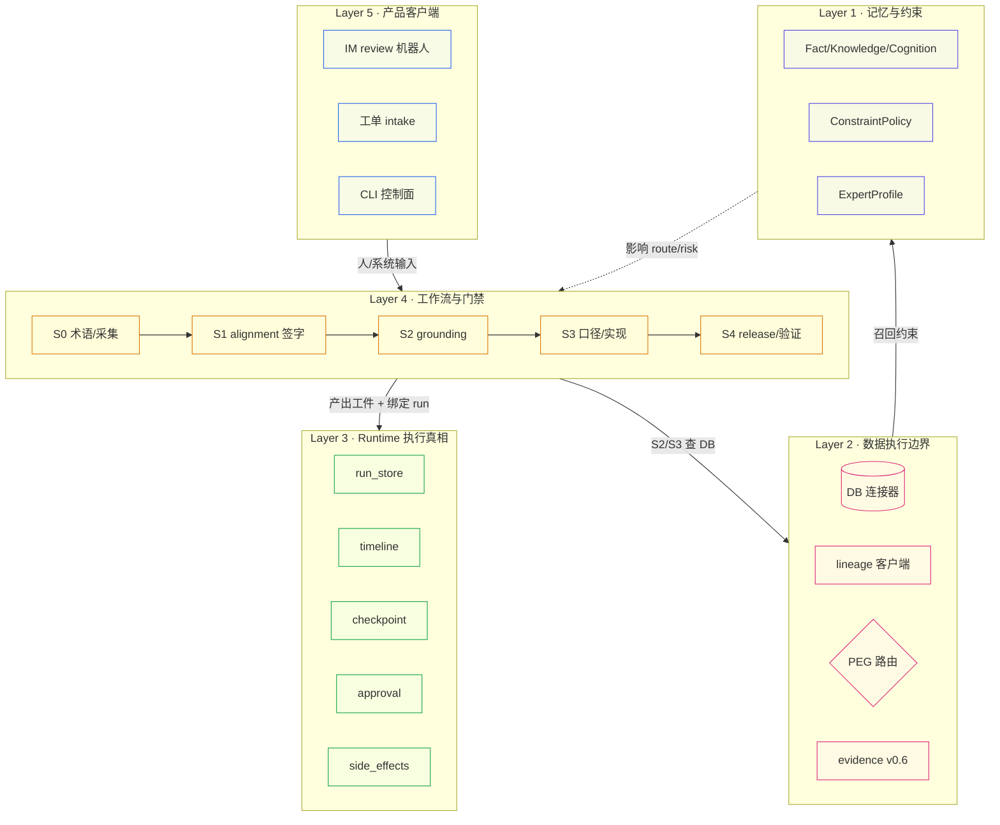
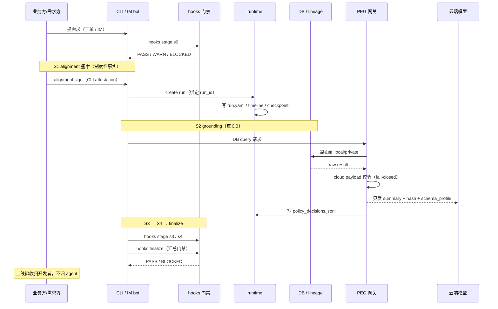

# 02 · 工程系统全景

> 为什么读这篇：上一篇讲了"为什么这么设计"，这篇讲"系统实际上长什么样"。
> 读完带走：模块地图 + 能力清单（C01–C16）+ 产物契约分层 + 数据如何在各层流动。

## 一张图：系统的五个层

demands_agent 不是单体应用，是五层严格分离的结构。**每一层有自己的边界，不互相覆盖**——这个设计源自 PM-018（SOP 形式遵循）的教训：如果层与层之间没有硬边界，AI 会在叙述里把多层揉成一团，掩盖掉任何一层的漏洞。

读图要点：
- **箭头方向是依赖方向**，不允许反向。比如 `memory` 可以影响 workflow 的路由决策，但 workflow 不能反向写 memory 的 fact（fact 只能从 evidence 派生）。
- **L5 客户端永远不拥有状态真相**。IM 客户端挂了，CLI 还能解释"这个需求走到哪了、为什么"。这是 [[07-什么是Agent与研究笔记]] 要素 1 的落地。

## 模块地图：每层里有什么

下面这张表是按"职责"而不是"文件名"组织的——这是 demands_agent 自己 `docs/architecture/module-map.md` 的写法。**按职责理解模块，才能看出边界；按文件名理解，只会看到一堆 .py。**

| 层 | 模块 | 职责 | 关键边界 |
|---|---|---|---|
| **L5 客户端** | `cli.py` | Typer 命令编排；当前的产品控制面 | 是控制面，不是状态真相所有者 |
| | `review/` | 工单 intake、需求质量、readiness、bot 编排 | 可诊断、可提议，不执行 release 副作用 |
| | `im_adapter/` | IM source/review/workspace/writeback | 是第一个客户端，不是 core runtime |
| **L4 工作流** | `hooks/` | S0–S4 + manifest 门禁；权威 stage status 写入者 | gate 只认 RAW 工件 |
| | `release_scope.py` | 签字 alignment → release scope 契约 | **禁止手写绕过** |
| | `release_manifest.py` | 机械派生的 release manifest | **禁止直接编辑** |
| | `evidence.py` | v0.6 权威 evidence 助手（hash/policy/citation） | 是事实基底，release 声明的唯一合法来源 |
| **L3 Runtime** | `runtime/run_store.py` | 创建 run 目录和 run 日志 | runtime 是执行真相源 |
| | `runtime/timeline.py` | append-only 运行事件 | 文档/聊天摘要不能覆盖 |
| | `runtime/checkpoint.py` | hash 绑定的 resume 断点 | 检测中间状态篡改 |
| | `runtime/side_effects.py` | 副作用计划/执行策略 | 必须 approval-gated |
| **L2 数据执行** | `database/connector.py` | SR/Hive/Presto 查询路由 | 必须留在数据执行边界内 |
| | `database/lineage_client.py` | Nebula 血缘/catalog API | raw 结果不泄漏到云工件 |
| | `private_execution/` | 云边界、路由决策、PEG、本地模型适配器 | 敏感执行边界 |
| **L1 记忆** | `memory/fkc_*.py` | Fact/Knowledge/Cognition 对象与召回 | **硬边界：Fact 证明，Knowledge 指导，Cognition 路由** |
| | `memory/constraint_*.py` | ConstraintPolicy + 需求级 envelope | 约束必须可溯源到 fact |
| | `knowledge/` | 领域知识物料 | 静态资料层，不自动进 memory |

## 能力清单：C01–C16

这是 demands_agent `capability-map-current.md` 里的 16 个能力，按成熟度标注。**这张表的价值不在"我们有多少能力"，而在"哪些成熟、哪些是缺口"**——诚实的成熟度标注比能力数量重要得多。

| ID | 能力 | 成熟度 | 一句话 |
|---|---|---|---|
| C01 | CLI 与命令面 | 🟢 Mature | 当前产品控制面 |
| C02 | S0–S4 工作流门禁 | 🟡 Mature but incomplete | 能检测文件/语法级失败，但语义义务仍可能形式通过 |
| C03 | 工单/IM review intake | 🟡 MVP | bot-first 编排、bridge handler 已有，多轮/writeback 待补 |
| C04 | 需求质量与 effective requirements | 🟡 Partial | 已有种子，待做成 first-class 权威输入 |
| C05 | 数据执行与 DB 查询边界 | 🟡 Mature core, uneven policy | 连接器成熟，policy 闭环不均 |
| C06 | 权威 evidence | 🟢 Mature core | hash/policy/citation/stale 检测齐全 |
| C07 | release scope/manifest 治理 | 🟢 Mature core | 从签字 alignment 机械派生 |
| C08 | 实时接入与 tag bootstrap | 🟡 Partial→Mature (手动 SOP) | 实时平台是 first-class 资产，不是表别名 |
| C09 | 长期记忆与 FKC | 🟢 Mature core, 待扩容 | Fact/Knowledge/Cognition 硬分层 |
| C10 | 专家约束 | 🟢 Mature core | 结构化 ConstraintPolicy，不是 prompt persona |
| C11 | Private Execution Gateway | 🔵 Release candidate | cloud payload fail-closed |
| C12 | Runtime timeline/checkpoint/resume | 🔵 Release candidate | 可恢复、可重放 |
| C13 | approval-gated side effects | 🔵 Release candidate | DDL/线上操作不静默执行 |
| C14 | Dashboard 质量观测 | 🟡 MVP | 能扫出 issue candidate，闭环未完成 |
| C15 | validation 与 fault injection | 🟡 Partial | 存在但还不是通用 pre-release gate |
| C16 | knowledge/postmortem/issue 治理 | 🟡 Active but uneven | 学习材料强，转成强制 gate 不均 |

**怎么读这张表**：🟢 = 可以拿来对外说"这个我们做透了"；🟡 = 能用但有已知缺口；🔵 = 有实现但还没经历过足够多的真实需求打磨。这张表本身就是一个诚实度承诺——[[06-收获与边界]] 会展开每个缺口的具体含义。

## 产物契约分层：一个需求工作区里有什么

```mermaid
flowchart TD
    subgraph Review["review/ · 需求采集"]
        TS[ticket_snapshot]
        ER[effective_requirements]
        QR[quality_report]
        KFR[known_fact_resolution]
    end

    AL["alignment.md<br/>业务方签字<br/>(制度性事实唯一来源)"]

    subgraph Ref["reference/ · S2/S3 工程产物"]
        OAM[object_admission_matrix]
        SC[scope_convergence]
        EP[evidence_plan]
        PE[probe_evidence]
    end

    AN[analysis.md<br/>方案设计]

    subgraph RelContract["release 契约"]
        RS[release_scope.yaml<br/>签字派生]
        RM[release_manifest.yaml<br/>CLI 机械派生]
    end

    subgraph RelPkg["release/ · 分层包"]
        DDL[01_ddl]
        ETL[02_etl]
        VAL[04_validation]
        OPS[05_ops]
    end

    subgraph Runtime["runs/ · runtime 真相"]
        RY[run.yaml]
        TL[timeline.jsonl]
        CP[checkpoint.json]
        PD[policy_decisions.jsonl]
    end

    HS[hooks/status.json<br/>gate 状态]

    Review --> AL --> Ref --> AN
    AN --> RelContract --> RelPkg
    RelPkg -.->|"runtime 绑定"| Runtime
    Runtime -.->|"stage 状态"| HS

    classDef signed fill:#fef3c7,stroke:#d97706,stroke-width:2px
    classDef derived fill:#dbeafe,stroke:#2563eb,stroke-width:2px
    classDef truth fill:#dcfce7,stroke:#16a34a,stroke-width:2px
    class AL signed
    class RS,RM derived
    class RY,TL,CP,PD,HS truth
```

`[真实产物 · 结构脱敏]` 这是 `output/demands/<demand_id>/` 的典型结构。**每个文件都是契约，不是笔记**——意思是它有强制 schema，gate 会校验。

**这张图的三种颜色是三种权限**：
- 🟡 **签字源（signed）**：`alignment.md`，只能由业务方通过 CLI attestation 创造，**手改无效**。
- 🔵 **派生契约（derived）**：`release_scope.yaml` / `release_manifest.yaml`，由 CLI 从上游机械派生，**禁止手写**。
- 🟢 **执行真相（truth）**：`runs/` 下的一切 + `hooks/status.json`，是执行过程的唯一权威。

这条"颜色 = 权限"的约定不是装饰，是 [[03-可迁移法则]] 法则 2（客观 vs 制度性事实）的工程落地。

## 数据如何流过这个系统

把上面三层（层 / 模块 / 产物）串起来，一个需求从进入到交付的数据流是：

**这张时序图最值得注意的两条**：
1. **云端模型永远不直接碰 raw result**。DB 查询走 PEG，PEG 只把 summary/hash/schema_profile 发给云端模型。raw 留在 local。
2. **finalize PASS 不等于交付完成**。最后一步是"上线验收归开发者"——agent 的边界在 release package，不在线上操作。这条在 [[07-什么是Agent与研究笔记]] 要素 4 里展开。

## 这套结构的成本

我不想让这套结构看起来是免费的。它的成本是：

1. **学习曲线陡**。一个新需求要走过 S0–S4 + finalize，每个阶段都有产物契约。比起"直接让 AI 写 SQL"，这套流程前期很重。
2. **维护成本高**。16 个能力、五层结构、二十多道 gate，每一处改动都要考虑上下游契约。
3. **不是所有需求都配**。一个一次性的 ad-hoc 查询，走完整 SOP 是杀鸡用牛刀。所以系统引入了 typed routing（`standard` / `complex` / `diagnostic`），让简单需求走轻量路径。

**这套结构换来的东西**是：一个会写 SQL 的 AI，在工业现场交付时，每一次关键事实都有 evidence、每一次越权都有 gate 拦截、每一次中断都能 resume。这个 trade-off 值不值，取决于你的需求场景容不容得下"形式合规地撒谎"。

---

上一篇：[[01-痛点与设计]] ｜ 下一篇：[[03-可迁移法则]]
