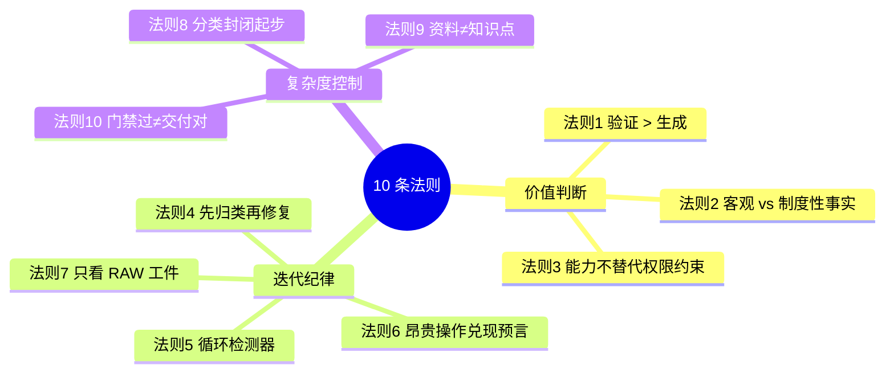

# 03 · 可迁移法则 — 从 21 篇 postmortem 提炼的 10 条

> 为什么读这篇：这是整个案例集最值钱的一篇。
> 读完带走：10 条可以从这个项目迁移到任何 Agent 项目的法则，每条都有反例、原则、本项目实例、迁移指引。

## 这篇为什么最重要

代码会过期，模型会换代，但这 10 条法则不会。它们是我从 21 篇 postmortem（PM-001~021）里反复被打脸之后提炼出来的——**每一条背后都站着至少一次真实事故**。

我刻意把它们写成"法则"而不是"建议"。"建议"可以不遵守，"法则"是不遵守就会重新交学费。每条法则的格式统一：

> **法则 N：一句话标题**
> - **反例**：不遵守时会怎样（对应真实 PM）
> - **原则**：为什么这条成立
> - **本项目实例**：在 demands_agent 里怎么落地
> - **如何迁移**：用到别的 Agent 项目时怎么做

---

## 法则 1：价值住在"验证"里，不住在"生成"里

- **反例**：PM-003——AI 未做字段核验直接猜测并交付，导致脚本失效。生成内容很流畅，但根本没去查字段是否存在。
- **原则**：生成能力会被下一代模型碾压，验证能力随模型变强而增值。判别工具是一个过滤器——假设 worker 无限聪明且诚实，这段代码还需要吗？需要的进 kernel/contract（升值），不需要的进 scaffolding（标注退役条件）。
- **本项目实例（诚实版）**：evidence v0.6 体系（hash/policy/citation/stale 检测）是"验证"的工程化，release 声明只能从 evidence 派生——这是做透了的部分。但 **kernel vs scaffolding 的系统化资产分类并没有落地**：目前只有 memory 层有退役标注（`review_status: deprecated/refuted/stale`），模块/契约/gate 层面没有可见的"这条该升值 / 这条该退役"标注。我自己也无法一眼看出哪些代码是 kernel。所以这条法则对项目而言是**方向正确但执行未完成**，我把它列为第一条，是因为它应该成为下一步的资产分类纪律。
- **如何迁移**：做任何 Agent 项目，第一步问"这个项目里什么是生成、什么是验证"。把工程力气投在验证侧——它会随模型变强而升值。但别重蹈我的覆辙：**只把验证做出来还不够，要同时给"哪些是会升值的 kernel"打上可见标注**，否则下一个模型升级时你不知道该退役什么。

## 法则 2：区分客观事实和制度性事实，是整个 Agent 治理的地基

- **反例**：参数化指标被静态字段化（ISSUE-010）——AI 把一个本该业务方回答的语义问题（核销率带不带月份筛选），自己拍板成了静态字段，导致看板数字静默出错。
- **原则**：事实分两种。**客观事实**（brute fact）机器去查就能知道；**制度性事实**（institutional fact）必须由有权限的人宣告才存在。机器只能观察第一种，永远无权创造第二种——**不是因为做不好，是因为没资格**。模型越强，越危险，因为它会把越权写得更流利。
- **本项目实例**：`alignment.md` 必须经 `alignment sign`（CLI attestation）签字，手改"已确认:"行无效；`release_scope.yaml` 只能从签字 alignment 派生。
- **如何迁移**：拿到一个 Agent 项目，先列清单——哪些环节产出客观事实（可以交给机器 + evidence），哪些产出制度性事实（必须人工签字）。后者永远不能因为"模型够强了"就去掉人工确认。

## 法则 3：对能力的信任永远不能替代对权限的约束

- **反例**：PM-016——样例验证 SQL 被误交付为生产 merge patch。AI 能力完全够写出正确的 patch，但它没有先拉现网 SQL 核对，而是直接产出了一个带样例过滤的独立查询。
- **原则**：`--force` 管控、taint 标记、approval-gated side effects——这些不是对愚蠢的防范，是制度对任何智能体（包括天才员工）的要求。**能力越强，越需要权限约束，而不是越可以放松约束。**
- **本项目实例**：所有副作用（DDL / release mutation / 线上操作）走统一生命周期：`intent → risk classification → preview → approval → controlled execution → post-check → rollback`。agent 永远不静默执行线上变更。
- **如何迁移**：每次模型升级，不要问"能不能去掉这层审批"，要问"这层审批防的是不是制度性事实"。如果是，模型升级与此无关。

## 法则 4：先归类，再修复；修复必须收敛到原语，而不是长出补丁

- **反例**：PM-002——需求处理绕过 SOP 导致方向偏差。出问题时只修那一个点，没有归类，结果同类问题反复出现。
- **原则**：走出 bug 循环的全部秘密就这一句。操作化为 issue 模板三问：这属于哪个 fact class？违规类型是什么（drift / admission gap / unauthorized write / contract gap）？结构修复对应哪个既有原语？**归类失败本身是最高价值信号**——它意味着 taxonomy 需要生长，而不是需要一个新 gate。
- **本项目实例**：21 篇 PM 全部按 Category（Config / Process / Data）+ Severity（High/Medium/Low）归类，见 [[04-真实复盘]] 的统计表。每次新 PM 先归类，再决定是加 gate、改 contract、还是生长 taxonomy。
- **如何迁移**：建立 issue 模板三问。每次出 bug 先填这三问再动手修——你会发现自己有一半的"新 bug"其实是老问题换了层皮。

## 法则 5：装循环检测器，把"是否在打转"从体感变成可判定

- **反例**：PM-010/011——历史回灌反复试错。SQL 执行路径没收敛，同样的失败重复出现，但因为每次都在"修东西"，体感上像在推进，实际在打转。
- **原则**：每轮迭代后问四个问题：边界推进了吗？新问题可归类吗？已修问题复发了吗？剩余阻断是等人还是等工程？**四问全过就是掘进，不是循环。**
- **本项目实例**：这套四问现在是我做任何长任务的标准收尾动作。它治好了我至少两次"走不出来"的焦虑——那两次数据都显示我在掘进。
- **如何迁移**：把四问写进每次迭代的收尾模板。如果你发现四问里有任何一个答不上来，停下来——你不是在推进，是在打转。

## 法则 6：昂贵操作只用来兑现预言，不用来探索

- **反例**：PM-010——历史回灌未先核验源数据可回放性，直接开跑，结果反复切换执行路径。
- **原则**：预演清单（`staged dry-run → 预期全绿 → 才 fresh rerun`）把 rerun 从"试试看"变成"验证一个已被预演支持的预期"。推广形式：**任何昂贵动作（全量重跑、模型升级、真实业务打扰）之前，先写下预期结果；跑完对账。对不上的偏差就是下一个 issue 的全部内容。**
- **本项目实例**：release 前的 self-test convergence、DS 兼容性 smoke、schema 真值核验，都是"先写预期再执行"的实例。
- **如何迁移**：任何涉及 rerun / replay / 全量重跑 / 真实用户打扰的操作，强制要求"先 dry-run + 写预期 + 再 fresh run"。rerun 退化为盲目探索是最贵的浪费。

## 法则 7：只看 RAW 工件，不看执行者叙述

- **反例**：PM-003——AI 在分析里写"已验证字段存在"，但实际根本没跑查询。叙述是它的输出，不是证据。
- **原则**：review 的固定开头永远是一句——"请以 RAW gate 为准，不要根据 agent 叙述判断。"这不是不信任，是方法论。**叙述是 worker 的输出，工件才是证据。**
- **本项目实例**：runtime spine 下的 `timeline.jsonl` / `tool_calls.jsonl` / `policy_decisions.jsonl` 是执行真相的唯一来源。文档或聊天摘要不能覆盖 runtime logs。
- **如何迁移**：这条延伸出一个我很珍惜的观察——**你组织项目的方式本身就是产品的同构物**。builder/executor/monitor/外部 reviewer 的角色分离、拿证据包来评审、裁定写回 contract——你在用治理 Agent 的方法治理"开发 Agent 的过程"。这个元技能比任何单条代码都值钱。

## 法则 8：分类系统要"封闭起步、按需生长"，否则一定退化成杂物抽屉

- **反例**：如果允许 `finding_kind` / `check_type` / `violation_type` 这类字段随手填任意字符串，半年后字段里躺着四十个类型——重复、遗忘、只用过一次。分类系统就死了。
- **原则**：两条纪律的组合。**第一，起步封闭**：第一版只放确实需要的少数几个类型，不在名单里的值直接拒绝。**第二，判例驱动生长**：新类型必须由真实案例逼出来，且新增时必须回答三个问题——这个类型的事实由谁有权写入？需要什么证据支撑？什么条件下会失效？回答不了就不许进。
- **本项目实例**：postmortem 的 Category 只有三个（Config / Process / Data），但够用。`finding_kind` 第一版只有四个值。分类系统像法律一样，由判例驱动扩充，而不是由立法者的想象力驱动扩充。
- **如何迁移**：任何涉及"类型字段"的设计，默认封闭起步。想加新值？强制回答三问。这条治好了我多次"杂物抽屉化"的病。

## 法则 9：资料和知识点不是同一种东西

- **反例**：PM-020——dwh-quality 项目沉淀了大量表结构、血缘、owner 资料，但"没有形成有效的知识点"。agent 在新需求里仍然从头查 schema，等于资料不存在。
- **原则**：**资料回答"是什么"，知识点回答"我下一步应该做什么"。** 一个 memory entry 要被算作 effective knowledge point，必须同时满足五个条件：触发条件（trigger）、决策影响（decision delta）、可被引用（citable）、可被证伪（refutable）、有来源（provenance）。**5 条任一缺失 = 不算知识点，只算 information。**
- **本项目实例**：FKC schema 强制 memory entry 带 `trigger` / `decision_delta` / `citation_id` / `refutation_condition` / `source` 五个字段，缺任一字段 ingestion 拒绝。ingestion 不得把表 schema dump / 血缘 JSON 直接落入 memory。
- **如何迁移**：做任何知识库 / RAG / memory 系统，先问"我沉淀的是资料还是知识点"。如果是资料，它不会改变 agent 的任何决策，等于没有。把它转成知识点的唯一方法是补齐那五个字段。

## 法则 10：把"门禁过了"和"交付对了"彻底分开

- **反例**：PM-018——hooks stage s4 + finalize 全部通过，但 release 目录结构不规范、DDL 范围不完整。门禁只校"形式代理信号"，不校"交付覆盖闭环"。
- **原则**：门禁的角色必须被诚实地定义为"**必要，但远远不充分**"。它检查文件存在、SQL 命中静态红线、formal release SQL 数量大于零——但它拦不住"结构不规范 + 范围不完整"的 release 被误判为可交付。**永远不要把"gate 过了"当成"交付对了"。**
- **本项目实例**：hooks finalize 在 PM-018 之后被重新定义为"必要但不充分"。同时增加了 release scope coverage gate，让文档里写明的发布范围和 release 目录产物逐项对账。
- **如何迁移**：任何自动化门禁（CI、lint、gate）都只是"形式校验"。把"形式校验通过"和"语义正确"在认知上彻底分开——前者是机器能做的，后者需要人对着 RAW 工件复核。

---

## 一张图：10 条法则的关系

这 10 条不是孤立的，它们围绕三个主题：

如果只能记三条，记这三组的"纲"：
- **价值判断的纲**：法则 1（验证 > 生成）
- **迭代纪律的纲**：法则 7（只看 RAW 工件）
- **复杂度控制的纲**：法则 10（门禁过 ≠ 交付对）

---

## 这些法则的局限

诚实地说，这 10 条法则有一个共同的前提：**你的场景容不容得下"形式合规地撒谎"。** 如果你的场景是一次性 demo、是 happy path 展示、是容错率极高的玩具，这 10 条都是过度工程。它们只在工业现场——交付出错有真实代价的场景——才成立。

另外，这 10 条是我从**数据需求 Agent** 这个特定领域提炼的。换到代码 Agent、内容 Agent、客服 Agent，有些法则（比如法则 2 的客观/制度性事实区分）依然成立，有些（比如法则 6 的回灌预言）需要重新翻译。**迁移时不要照搬字面，要迁移法则背后的为什么。**

---

上一篇：[[02-工程系统全景]] ｜ 下一篇：[[04-真实复盘]] — 这 10 条法则每一条都被哪篇 postmortem 逼出来的，逐篇讲透。
