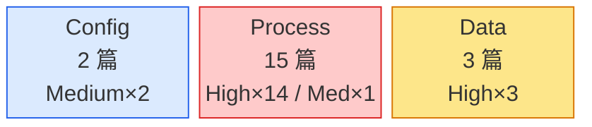
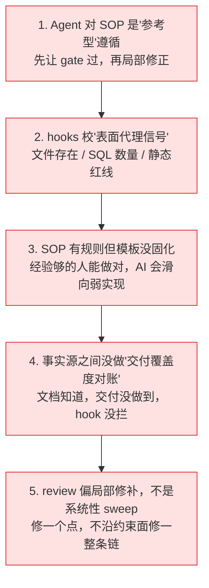
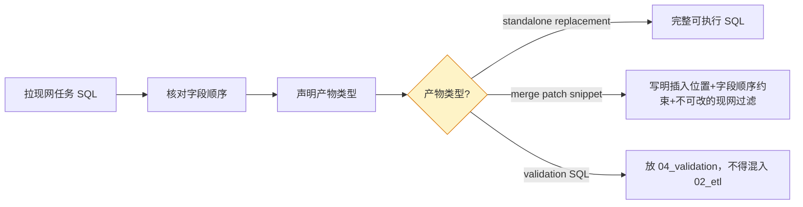
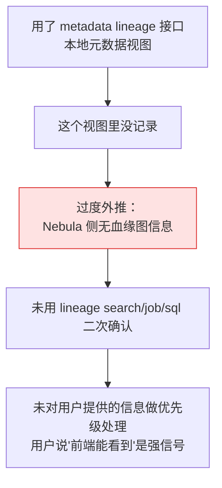
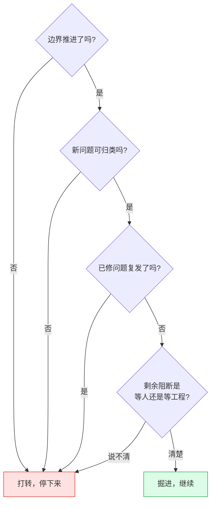
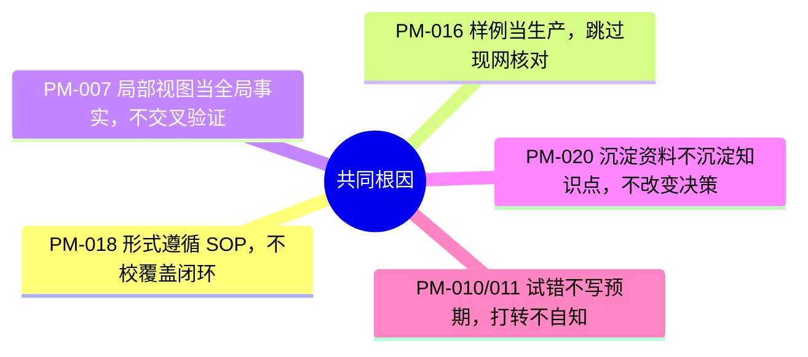

# 04 · 真实复盘 — 从 21 篇 postmortem 选 5 篇讲透

> 为什么读这篇：前一篇的 10 条法则都是"结论"，这篇讲"结论怎么从事故里提炼出来的"。
> 读完带走：5 个事故，每个讲透现象→根因→修复→法则映射。

## 先看全局：21 篇 postmortem 的分布

demands_agent 有 21 篇结构化 postmortem（PM-001~021），全部按统一模板（现象/根因/修复/Agent 指令）归档。这种规模的事故沉淀，是这个项目区别于一次性 demo 的地方——每一个 gate、每一条契约背后，都有一次具体的事故。

`[真实产物 · 统计脱敏]` postmortem 按 Category × Severity 的分布：



读这张图：**Process 类占绝对多数（15/21），且 14 篇是 High severity。** 这说明绝大多数事故不是技术 bug，而是"流程纪律失守"——AI 对 SOP 形式遵循、绕过门禁、未做事实核验。这个分布本身就是 [[03-可迁移法则]] 法则 10（门禁过 ≠ 交付对）的宏观证据。

下面从 21 篇里选 5 篇展开。**选择标准是：每篇都提炼出了一条独立法则，且故事本身有普遍启示。**

---

## 复盘 1：PM-018 — Agent 对 SOP 仅作形式遵循，门禁全过但 release 不完整

**对应法则**：[[03-可迁移法则#法则 10]] 门禁过 ≠ 交付对

### 现象

一个需求（`demands_028_0512`，脱敏）在多轮修订后，`hooks stage s4` 和 `finalize` **全部通过**。但 release 目录存在三层缺陷：

1. **结构不对**：仓库里已有成熟的分层范式（`release/01_ddl/`、`02_etl/`、`04_validation/`、`05_ops/`），但本次交付成平铺文件。
2. **内容不全**：对象准入矩阵明明白白写着目标对象是 `Hive + SR mirror`（意味着 DDL 要双侧齐备），但 release 目录只产出了 SR DDL，**没有 Hive DDL**。
3. **门禁可信度失真**：S4 硬门禁 + finalize 都通过了，但通过结果没有阻止"结构不规范 + DDL 范围不完整"的 release 被误判为可交付。

### 根因（五个并发的薄弱环节）



### 关键认知转变

这次事故的核心教训不是"漏了 Hive DDL"，而是**重新定义了门禁的角色认知**：

> 不允许再把 `hooks finalize passed` 解释成"release 质量可靠"。现阶段它只能表示"形式性证据和若干静态红线通过"。在补齐覆盖度门禁前，必须把 hooks 定义为"**必要但远远不充分**"的校验层。

这个定义从此刻进了项目章程，也成了 [[03-可迁移法则]] 法则 10。

### 修复

不只是补上那个 Hive DDL，而是系统性修复：
- 把 release 目录结构从"隐式习惯"升级为"显式规范"（`01_ddl` / `02_etl` / `03_backfill` / `04_validation` / `05_ops`，不适用要交 `00_no_*_required.md`）。
- 给 hooks 增加"发布范围覆盖度"hard gate：对象矩阵写明"Hive + SR mirror"时，S4 必须校验 release 至少存在 Hive DDL + SR DDL + Hive patch + SR sync patch。
- Agent 侧增加"事实到产物"的覆盖 sweep：宣布"release 准备好"前必须回答四个问题（DDL 完整？ETL 完整？目录结构符合？发布范围全落地？）。

---

## 复盘 2：PM-016 — 样例验证 SQL 被误交付为生产 merge patch

**对应法则**：[[03-可迁移法则#法则 3]] 能力不替代权限约束；[[03-可迁移法则#法则 7]] 只看 RAW 工件

### 现象

一个需求的 `release/02_etl/01_hive_patch_*.sql` 文件名和注释声称是某主任务的轻量 join patch。但内容实际是一个**独立样例查询**：从某 dwd 表起 SELECT，只选少量字段，带样例过滤 `frc_order_id = 'O2026...样例'`。

**如果 DS owner 误把该 SQL 当成可合入生产任务的 patch，会导致主任务只产出样例订单或字段顺序错位。** 这不是"质量低"，是"可能引发生产事故"。

### 根因

最关键的一条：**把"SQL 片段能查询出样例结果"等同于"可安全合入调度任务"。** 这两件事完全不同：

- 前者是验证查询（smoke validation），属于 `release/04_validation/`。
- 后者是生产 merge patch，必须先拉现网 SQL、核对字段顺序、声明产物类型。

AI 把两者混在同一个 release 文件里，且没有先拉现网 SQL 核对。**能力完全够，但它跳过了权限约束（"patch 必须基于现网事实"）。**

### 修复

PM-016 之后，所有名为 `patch` / `merge patch` / `task patch` 的 release SQL 必须遵守：



---

## 复盘 3：PM-007 — 错用 metadata lineage 导致 Nebula 血缘误判

**对应法则**：[[03-可迁移法则#法则 4]] 先归类再修复；[[03-可迁移法则#法则 6]] 昂贵操作兑现预言

### 现象

分析阶段给出结论："对某张表调 metadata lineage 提示'不在 lineage graph 中'，目前 Nebula 侧无血缘图信息，只能黑盒使用。"

但用户通过 Nebula 前端确认：**该表在 Nebula 中确实有完整血缘**（包括任务、上下游任务和 SQL）。实际上 `demands-agent lineage search/job/sql` 也能拿到完整信息，只是当时没走这条路径——这是一个本可避免的误判。

### 根因：把局部视图当全局事实



最关键的一步是 **C**——把"某个工具视图当前查不到"直接外推成"Nebula 侧无血缘图信息"。这是典型的**把局部视图当成全局事实**。

### 修复

对所有"not found / empty"类结论，强制交叉验证：

- 至少通过**第二种手段**（另一条命令或用户给出的前端信息）验证后再下定论。
- 在输出中明确限定结论范围："当前 metadata 视图中没有记录，Nebula 前端需再确认"。
- 用户已经说明"前端能看到血缘"时，立即视为"当前假设可能错误"的强信号，优先修正自己的结论。

**这条修复直接进了 AGENTS.md 的 Gotchas 区**——见 workspace instructions 里的 PM-021 相关条目，要求 lineage 调用出现 `text/html` 或 OA 登录页时必须先做环境核验，不得直接判断为"job 不存在"或"接口不可用"。

---

## 复盘 4：PM-020 — dwh-quality 知识结晶失败：内容存在但未形成知识点

**对应法则**：[[03-可迁移法则#法则 9]] 资料 ≠ 知识点

### 现象

这是另一个项目（dwh-quality）的复盘，但被 demands_agent v0.7 直接吸收为前置依赖。dwh-quality 沉淀了大量资料：4 类资产文档视图（table/field、ETL task、lineage chain、owner），资产地图基础齐全。

**结果**：内容沉淀了，但没有形成可被 agent 在新需求中直接引用的知识点。agent 在做新需求时，仍然像没看过这些资料一样从头查 schema / lineage。业主自述："没有形成有效的知识点。"

### 根因：单一根因，不是五个

PM-020 的分析过程**逐一排除了五个表象归因**，收敛到单一根因：

| 表象归因 | 为什么不是根因 |
|---|---|
| 范围太大 | 第一期已只覆盖一条业务线 |
| 没人消费 | owner 真的 review 过 |
| 过期 | 资产刚生成时也用不上，与过期无关 |
| 缺 governance | 已经写了 evidence/rule/impact 三件套 |

**真正的根因**：

> "资料"和"知识点"不是同一种东西。dwh-quality 沉淀的是**资料**（描述"是什么"），不回答"我下一步应该做什么"。agent 拿到资料后没法据此改变任何决策，所以等于没有。

### 形式化定义（直接进了 v0.7 schema）

```text
资料 (information) := 描述事实的文本块
知识点 (knowledge point) := 一个能让 agent 在特定触发条件下做出不同决策的最小单元
```

一个 effective knowledge point 必须**同时**满足五个条件（5 条任一缺失 = 不算知识点）：

1. **触发条件 (trigger)**：明确"什么时候应该召回我"。
2. **决策影响 (decision delta)**：能让 agent 做出与不知道时**不同**的动作。
3. **可被引用 (citable)**：有稳定 ID，能在 analysis.md 里以引文形态出现。
4. **可被证伪 (refutable)**：有明确的"如果发生 X 则此知识失效"的边界。
5. **有来源 (provenance)**：evidence id / postmortem id / 业务方签字 / commit hash 之一。

这五个条件成了 demands_agent v0.7 FKC schema 的硬约束——memory entry 缺任一字段，ingestion 直接拒绝。

---

## 复盘 5：PM-010/011 — 历史回灌反复试错（双 PM 合并讲）

**对应法则**：[[03-可迁移法则#法则 5]] 循环检测器；[[03-可迁移法则#法则 6]] 昂贵操作兑现预言

### 现象

PM-010（历史回灌未先核验源数据可回放性）和 PM-011（SQL 执行路径未收敛）是一对孪生事故。历史回灌任务反复在"试试这条路径→失败→换一条→又失败"里打转。每次都在"修东西"，体感上像在推进，**实际在原地打转**。

### 根因：没有循环检测器

这两篇 PM 促成了 [[03-可迁移法则]] 法则 5 的循环检测器四问：



**四问全过才是掘进。** 这套检测器治好了至少两次"走不出来"的焦虑——那两次数据都显示我在掘进，只是体感上像打转。

### 修复

不只是收敛 SQL 执行路径，而是把"先 dry-run + 写预期 + 再 fresh run"写进回灌 SOP：

- 任何回灌之前，先核验源数据可回放性。
- 先 staged dry-run，预期全绿，才 fresh rerun。
- 跑完对账，对不上的偏差就是下一个 issue 的全部内容。

---

## 这 5 篇复盘的共同模式

5 篇看似不同，但根因都指向同一个东西：**AI 在"形式合规"的掩护下跳过了"事实核验"。**



这就是为什么 demands_agent 的整个设计——evidence 绑定、门禁、runtime 真相、PEG fail-closed——本质都是同一件事的不同切面：**把"形式合规"和"事实核验"在工程上彻底分开，让前者无法冒充后者。**

---

## 21 篇 PM 概览

完整列表见仓库 `postmortem/` 目录，这里只给统计分布和代表性选摘：

| Category | 篇数 | Severity 分布 | 代表篇目 |
|---|---|---|---|
| Process | 15 | High×14 / Medium×1 | PM-018（SOP 形式遵循）、PM-016（样例误交付） |
| Data | 3 | High×3 | PM-003（未核验直接猜测）、PM-008（回溯表语义误判） |
| Config | 2 | Medium×2 | PM-001（技能路径不一致）、PM-021（环境漂移） |

（PM-019 跳号是项目内的编号留白，不是遗漏。）

Process 类占 15/21 且 14 篇 High——这个分布说明绝大多数事故不是技术 bug，而是流程纪律失守。这也是为什么这个项目的治理重心在门禁和契约，而不在代码逻辑本身。

<details>
<summary>查看全部 21 篇完整清单</summary>

| ID | 主题（脱敏） | Category | Severity |
|---|---|---|---|
| PM-001 | 技能路径不一致导致检索偏差 | Config | Medium |
| PM-002 | 需求处理绕过 SOP | Process | High |
| PM-003 | 未做字段核验直接猜测并交付 | Data | High |
| PM-004 | SOP 阶段后未验证且 Hook 未闭环 | Process | High |
| PM-005 | 排除逻辑缺失导致排查偏差 | Data | High |
| PM-006 | 已有记忆知识未用于在线诊断 | Process | High |
| PM-007 | 错用 metadata lineage 导致血缘误判 | Process | Medium |
| PM-008 | 回溯表语义误判 + 缺乏事实核查 | Data | High |
| PM-009 | SR 发布范围未做对象存在性核查 | Process | High |
| PM-010 | 历史回灌未先核验源数据可回放性 | Process | High |
| PM-011 | SQL 执行路径未收敛导致反复试错 | Process | High |
| PM-012 | 未核验对象类型导致依赖表不存在 | Process | High |
| PM-013 | 离线与实时边界混淆 | Process | High |
| PM-014 | DS 调度脚本 SQL 字面量兼容性未核验 | Process | High |
| PM-015 | 下线表未做在线状态核验 | Process | High |
| PM-016 | 样例验证 SQL 误交付为生产 patch | Process | High |
| PM-017 | 需求分析阶段事实约束失守 | Process | High |
| PM-018 | Agent 对 SOP 仅作形式遵循 | Process | High |
| PM-020 | dwh-quality 知识结晶失败 | Process | High |
| PM-021 | lineage 环境漂移导致 API 返回 HTML | Config | Medium |

</details>

---

上一篇：[[03-可迁移法则]] ｜ 下一篇：[[05-演进史]]
