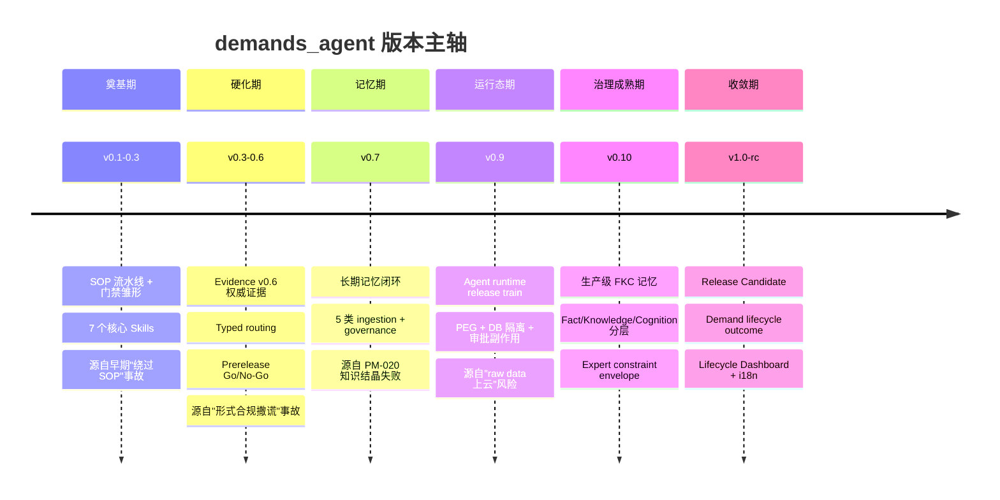
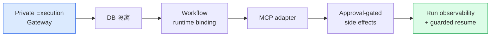

# 05 · 演进史 — 从 v0.1 到 v1.0-rc 长出了什么

> 为什么读这篇：一个项目怎么从"能跑的脚本"长成"有治理纪律的 Agent 系统"，版本演进是最硬的证据。
> 读完带走：六个版本里程碑 + 每个里程碑"长出了什么能力 + 源自哪些事故"。

## 版本主轴：一条曲线，不是一堆散点

demands_agent 从 v0.1 到 v1.0-rc，有三十多个 release。但真正定义这条演进曲线的是**六个里程碑版本**——每个里程碑都对应一个"治理主题"，且每个主题都源自真实事故的复盘。

读这条 timeline 的关键：**每个版本的主题不是"加了什么功能"，而是"补上了什么治理缺口"。** 这条曲线的方向始终一致——从"能力面"向"治理面"和"运行态面"移动。

## 六个里程碑详解

### v0.1–v0.3：奠基期 — SOP 流水线 + 门禁雏形

**长出了什么**：
- S0–S4 SOP 流水线（术语映射 → 采集 → grounding → 口径 → 上线素材）。
- 7 个核心 Skills（business-glossary / demand-intake / domain-explorer / trace-field-demand / deploy-prep / postmortem-precheck / create-postmortem）。
- 自动化门禁：每阶段硬门禁 + 软检查。
- v0.2.3 起 typed routing（standard / complex / diagnostic）。
- v0.3.0 prerelease hardening + Go/No-Go closeout。

**源自哪些事故**：PM-001~005 这批最早的事故——技能路径不一致、绕过 SOP、未做字段核验、Hook 未闭环。这个阶段的核心教训是"光有 SOP 文本不够，必须有机器执行的门禁"。

### v0.3–v0.6：硬化期 — Evidence v0.6 + Typed Routing

**长出了什么**：
- Evidence v0.6 权威证据体系：content hash、authority level、raw result policy、cloud context flag、stale/forged/dangling 检测、citation comments。
- Typed routing 把 S0/S1 之后的路径分成三种需求类型，每种有不同的 required/skipped stages。
- Prerelease evidence-basis synthesis + 显式 Go/No-Go closeout。
- v0.6 的 scoping 和 implementation spec 把 evidence authenticity 写成硬约束。

**源自哪些事故**：PM-003（未做字段核验直接猜测）、PM-007（lineage 误用）、PM-009（SR 发布范围未做对象存在性核查）。这个阶段的核心教训是"门禁必须消费结构化 evidence，不能消费叙述"——`analysis.md` 里写"看起来像验证过"已经不足以通过 S3/S4 门禁。

### v0.7：记忆期 — 长期记忆闭环

**长出了什么**：
- Memory schema / store：JSONL authority + SQLite runtime index。
- 5 类 ingestion：postmortem、alignment、demand、scrutiny、realtime metadata。
- Retrieval 按 trigger 召回 approved memory，并记录 recall event。
- Citation：analysis / alignment 中的 memory 引用可被 gate 校验（`S6-MEMORY-CITATION`）。
- Governance：low-utility、stale、contradiction 只作为信号层，不自动裁决事实。
- CC PreToolUse 保护：阻止手写 memory、篡改 index、伪造 citation。
- Fault injection：9 个 memory 滥用场景全量 fail-closed。

**源自哪些事故**：PM-020（dwh-quality 知识结晶失败）。这次事故的直接产物是 [[03-可迁移法则]] 法则 9（资料 ≠ 知识点）和 effective knowledge point 的五个必要条件。v0.7 把"经验复用"从文档阅读推进到可召回、可引用、可证伪、可门禁的长期记忆层。

### v0.9：运行态期 — Agent Runtime Release Train

**长出了什么**（v0.9.1–v0.9.5 一条完整的 release train）：

具体能力：
- **DB 隔离形式化**：workflow/cloud context 默认 evidence-only output；raw rows、credentials、敏感样本不进 cloud-facing stdout/reports。
- **Workflow runtime binding**：S0–S4 数据访问可绑定 v0.9 run。
- **Run state model**：`running` / `blocked-awaiting-external-input` / `completed` / `failed`，见 [[07-什么是Agent与研究笔记]] 机制 1。
- **Guarded resume**：checkpoint hash + timeline tail 校验。
- **Approval-gated side effects**：plan → preview → approval → execute → post-check → rollback。

**源自哪些事故**：raw data / credential 溜进云端模型的风险，以及长任务中断后无法恢复的工程痛点。这个阶段的核心是"让 Agent 的执行变得可控制、可审计、可恢复"。

### v0.10：治理成熟期 — 生产级 FKC 记忆

**长出了什么**：
- 生产级 Fact / Knowledge / Cognition 记忆层。
- Expert constraint envelope（结构化 ConstraintPolicy，不是 prompt persona）。
- Facts 保持 source-backed、append-only、hash-checked。
- Knowledge 必须从当前 approved facts 派生。
- Cognition 可以指导路由，但不能证明事实声明。
- FKC memory schemas、store、SQLite index、source inventory、consolidation checks、citation gates 全套。

**意义**：这个版本把项目从"ad-hoc memory notes"推进到"可审计、分层的组织知识"。FKC 的硬分层（Fact 证明 / Knowledge 指导 / Cognition 路由）是 [[07-什么是Agent与研究笔记]] 五属性里 Governed learning 的工程落地。

### v1.0-rc：收敛期 — Release Candidate

**长出了什么**：
- Governance repair（issue-108，authority/write-side discipline fixes）。
- Demand lifecycle outcome kernel：`current_outcome.json` authority、freshness regeneration、run/closure records。
- Lifecycle Dashboard：单需求 Lifecycle Console、portfolio index、legacy workbench、zh/en i18n。
- Private execution hardening：agent DB 查询需要 credential broker；内部 metadata tools 被 audit。
- Distribution：root `SKILL.md` 一行 agent install flow、distribution-readiness 文档。

**诚实的边界**：v1.0-rc.1 的 release notes 第一句就写明——"It is **not GA** and does **not** mean production deployment is complete." 这种在 release notes 里主动声明"我没完成"的诚实，本身就是一种成熟度信号。

## 版本对照表

`[真实产物 · 版本号真实，细节脱敏]`

| 版本 | 主题 | 核心产出 | 源自的事故 |
|---|---|---|---|
| v0.1–0.3 | SOP + 门禁雏形 | S0–S4、7 Skills、typed routing、Go/No-Go | PM-001~005（绕过 SOP） |
| v0.3–0.6 | Evidence 权威化 | Evidence v0.6、hash/policy/citation、prerelease synthesis | PM-003/007/009（形式合规撒谎） |
| v0.7 | 长期记忆闭环 | Memory schema、5 类 ingestion、citation gate、fault injection | PM-020（知识结晶失败） |
| v0.9 | Agent runtime | PEG、DB 隔离、run state model、guarded resume、approval-gated side effects | raw data 上云风险 + 长任务不可恢复 |
| v0.10 | 生产级 FKC | Fact/Knowledge/Cognition 分层、expert constraint envelope | 记忆污染决策风险 |
| v1.0-rc | 收敛 + lifecycle | outcome kernel、Lifecycle Dashboard、i18n、distribution | governance audit 发现的 write-side 纪律缺口 |

## 这条演进曲线的元规律

如果要从这条曲线里提炼一条元规律，我会说：

> **每个版本都在回答同一个问题的不同切面——"怎么让一个会写 SQL 的 AI 在工业现场可信"。v0.1 回答"怎么让它走流程"，v0.6 回答"怎么让它不带谎"，v0.7 回答"怎么让它记得住教训"，v0.9 回答"怎么让它的执行可恢复"，v0.10 回答"怎么让它的记忆不污染决策"，v1.0-rc 回答"怎么把这些收敛成产品"。**

这条曲线没有"加功能"的版本——每个版本都是在补一个被事故暴露的治理缺口。这是我认为这个项目最值得拿出来说的一点：**它不是功能堆砌，是问题驱动**。

---

上一篇：[[04-真实复盘]] ｜ 下一篇：[[06-收获与边界]]
