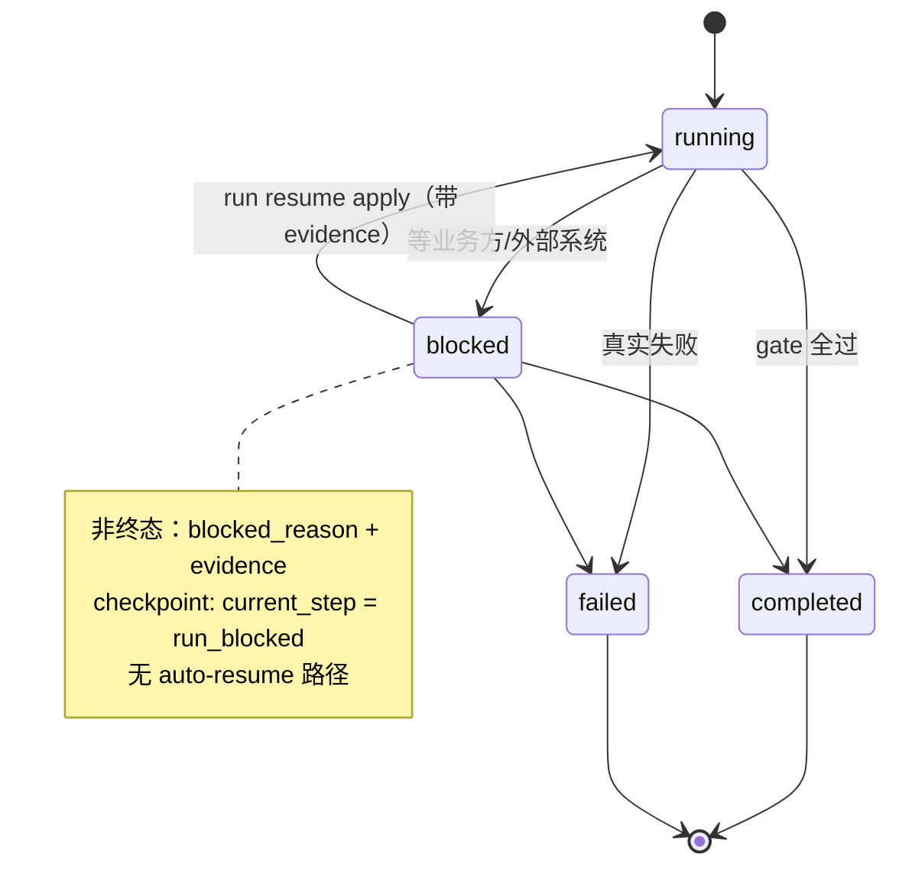

# 07 · 什么是 Agent — 从 demands_agent 反推出的设计要素与工业鲁棒性

> 为什么读这篇：前面六篇都在讲"这个项目做了什么"。这篇退一步，讲"从做这个项目里，我反推出的 Agent 到底是什么、设计上必须有哪些要素、怎么让长程任务在工业现场跑得稳"。
> 读完带走：一个可证伪的 Agent 定义 + 六个不可妥协的设计要素 + 长程任务工业鲁棒性的五条具体机制。
> 文风对标 `AIx/agents/研究/`：研究型长文，有判断、有引用、最后落到工程原则。

## 执行摘要

做完 demands_agent 之后，我对"什么是 Agent"的定义收窄了。**一个真正的 Agent 不是更长的 prompt、不是一组脚本、也不是一个 IM bot——它是一个由 runtime 控制的任务交付系统：能把一个任务带过规划、执行、验证、恢复、学习，同时保留证据、决策归属和可恢复状态。**

这个定义不是我拍脑袋想的，是在 21 篇 postmortem 的复盘过程中，一篇一篇提炼出来的。最早我以为"Agent = LLM + 工具调用"，后来被"AI 在交付里形式合规地撒谎"打脸（PM-003）；加上"门禁形式通过但语义漏项"（PM-018）、"AI 越权裁决业务语义"（PM-010）、"raw data 溜进云端"（数据边界事故）这几次之后，我才意识到：**会想、会写、会调用工具，只是 Agent 的"能力面"；真正让一个 Agent 能在工业现场上岗的，是它的"治理面"和"运行态面"。**

本文把这三面拆成六个不可妥协的设计要素，再用 demands_agent 的真实机制回答一个核心问题：**怎么让一个长程任务（跨多次工具调用、跨人工审批、跨中断恢复）在工业现场可重跑、可断点、可审计。**

文中的每一条机制都对应 demands_agent 里的真实产物或代码契约，不是泛泛而谈。

---

## 一、什么是 Agent — 一个可证伪的定义

市面上对 Agent 的定义太宽。负责任的 AI 翻译软件把 agent 译成"特工"，这有点黑色幽默：正是这个被鄙视的翻译，安慰了正在担心被 AI 替代的打工人。但真正发生替代的地方，从来不是"机器取代人力"，而是"人力转移到更适应新时代的位置"。所以不要着急去定义一个永恒的 Agent——现在的 Agent 从历史看，很可能只是那辆初代跑不过马车的蒸汽机车。

但在工程现场，我需要一个**可证伪**的定义来指导设计。我落到的是这五个属性，它们全部能在 demands_agent 里被证伪——缺任何一条，我就不承认那是一个 Agent，只是一个"会调用工具的 LLM 包装"：

| 属性 | 含义 | 缺了会怎样 | demands_agent 里的证据 |
|---|---|---|---|
| **Grounded（有依据）** | 关键事实必须引用 evidence / memory / schema / lineage / test / 签字 alignment，不能只靠叙述信心 | AI 在分析里写"已验证"但根本没查 → PM-003 | S0–S4 gate 持久化状态；release scope 从签字产物派生 hash |
| **Runtime-bound（绑定运行态）** | 工作必须绑定 run id、timeline、checkpoint、approval、side-effect records | "我以为跑过了"无法证伪 | 每个 demand 绑定 `runs/<run_id>/`，含 run.yaml / timeline.jsonl / checkpoint.json |
| **Boundary-aware（理解边界）** | raw data / credential / 敏感 rowset 不能静默进入云端模型 context | 一次 raw rowset 上云 = 一次数据安全事件 | Private Execution Gateway 在 cloud payload 上 fail-closed |
| **Recoverable（可恢复）** | 中断或带副作用的工作必须有 checkpoint 和 manual resume 语义 | 长任务一断就废，只能从头来 | checkpoint hash + timeline tail 校验；blocked / resume 状态机 |
| **Governed learning（可治理学习）** | memory 可以影响 route / risk / required checks，但 fact / knowledge / cognition / constraint 必须分层 | 学习变成"记忆污染决策"，越用越歪 | FKC schema 分离 FactRecord / KnowledgeEntry / CognitionPolicy |

**这个定义的判别力在于：它能区分"Agent"和"会调用工具的 LLM"。** 后者只有能力面，前三条属性基本不满足。一个没有 runtime 绑定、没有 evidence 绑定、没有边界意识的系统，哪怕能调一百个工具，也不是 Agent——它是一个"会花式撒谎的 LLM 包装"。

由此得出一条我反复验证过的推论：**判断一个系统是不是 Agent，不要看它的能力清单，看它失败的时候有没有留下可审计的痕迹、能不能从断点恢复、越权的时候有没有被拦。** 能力是 commodity，治理和运行态才是分水岭。

---

## 二、Agent 设计的六个不可妥协要素

我把上面五个属性展开成六个设计要素。这六个要素是我做 demands_agent 时"补"出来的——每一条背后都站着至少一篇 postmortem。

### 要素 1：能力面 ≠ 治理面，必须分层

**最常见的错误是把"能力"当成"Agent 本身"。** 一个能写 SQL、能查 DB、能调 lineage API 的 LLM，只是有了能力面。真正让它成为 Agent 的，是套在外面那层治理结构。

demands_agent 的分层是：

```text
Core runtime        run id / timeline / checkpoint / approval / actor contract
                    （不依赖任何具体客户端存在）
Client adapters     IM adapter / review bot / bridge / 工单 intake
                    （是客户端，不拥有状态真相）
Data exec boundary  DB 执行策略 / raw result 留存 / local-private 路由 / cloud 校验
Artifact & gate     S0-S4 artifacts / release scope / release manifest / hook status
Memory & constraint Fact / Knowledge / Cognition recall + Constraint envelope
```

**纪律是：IM 客户端可以是第一个客户端，但 runtime contract 不能依赖它才能成立。** 任何一个客户端挂了，runtime 还得能独立解释"这个需求走到哪了、为什么"。

### 要素 2：客观事实 vs 制度性事实 — 权限分层的地基

这条是整个项目的地基，也是 [[03-可迁移法则]] 法则 2 的来源。

事实分两种：
- **客观事实 (brute fact)**：世界本来就是那样，机器去查就能知道。表里有没有 `create_day` 字段、某任务昨天跑没跑成功、某 SQL 返回多少行。真假不依赖任何人的态度。
- **制度性事实 (institutional fact)**：不是被"发现"的，是被**有权限的人宣告出来**的。生效范围是 6 月起、这个残余风险我们接受、这份交付验收通过。在业务方签字之前，"生效范围是 6 月起"这件事**根本不存在**。

**核心推论：机器只能观察第一种事实，永远无权创造第二种。** 模型能力越强，越危险——它不会停止越权裁决，只会把越权写得更流利。所以哪些环节必须人工签字，取决于该环节产出的是哪种事实，而不是模型够不够聪明。

demands_agent 里 `alignment.md` 必须经 `alignment sign`（CLI attestation）签字，手改"已确认:"行无效；`release_scope.yaml` 只能从签字 alignment 派生。

### 要素 3：所有关键步骤必须可追踪（trace 是生产系统的一部分）

OpenAI Agents SDK Tracing、LangSmith、Phoenix 都把 trace、dataset、grader、online evaluation 放在核心位置。这不是巧合——**对工业级 Agent，trace 不是"调试附加项"，是生产系统的一部分。**

demands_agent 的 runtime spine 落在 `output/demands/<demand_id>/runs/<run_id>/` 下，append-only：

```text
run.yaml                run 元数据 + 状态
timeline.jsonl          append-only 事件流（seq / event_id / prev_event_id / actor / event_type / refs）
checkpoint.json         断点
policy_decisions.jsonl  每次 cloud/local/private 路由决策
tool_calls.jsonl        工具调用（call_id / status / side-effect flag / evidence ref）
model_calls.jsonl       模型调用
approvals.jsonl         审批
side_effects.jsonl      副作用记录
artifacts/evidence/     证据镜像
sensitive/raw/          敏感原始区（限制权限，local-only）
```

**纪律是：任何关于"agent 做了什么"的断言，在 runtime 模式下必须能追溯到 timeline / tool / model / policy / approval log。** 这条纪律的来源是 PM-003——AI 在叙述里说"已验证"，但 timeline 里根本没有对应的 tool_call。从那以后，我的 review packet 固定开头永远是："请以 RAW 工件为准，不要根据 agent 叙述判断。"

### 要素 4：所有高风险动作必须支持中断与人工裁决

LangGraph 的 human-in-the-loop 中间件明确支持 approve / edit / reject / respond——这比"事后审计"更适合工作流型 Agent。**事后审计只能追责，事前审批才能拦截。**

demands_agent 把所有副作用（DDL / release mutation / 平台线上操作 / 带副作用的 MCP 调用）统一进一个 approval-gated 生命周期：

```text
side-effect intent
  → risk classification
  → preview / dry-run
  → approval record
  → controlled execution
  → post-check evidence
  → rollback or closeout
```

**纪律是：agent 永远不静默执行线上变更。** 它只拥有 release package；线上调度修改、执行、验收是开发者的责任。这是有意的边界，不是待补的缺口。

### 要素 5：安全默认拒绝（fail-closed，不是 fail-open）

MCP 官方安全文档与 Anthropic 的 prompt injection 研究都指出：连接外部系统的 Agent 会引入新的数据访问与执行路径风险。所以需要 allowlist、最小权限、双向审计、敏感工具审批。

demands_agent 在两个地方 fail-closed：
1. **Cloud boundary**：检测到 raw rowset / API key / bearer token / cookie / password / 本地必敏感物料时，直接阻断 cloud payload，不让它进入云端模型 context。
2. **DB 查询路由**：`query_sr()` 是 SR-only，遇到 SR 错误（包括表不存在）直接 fail-closed，不会自动降级到 Hive。降级必须走明确的 `query_auto()` 路径，且只在 Presto OOM 时才转 Hive。

**纪律是：宁可误拦，不可漏放。** 一次误拦是可以调试的工程问题；一次 raw data 上云是没法撤回的安全事件。

### 要素 6：分类系统封闭起步、按需生长

这条针对的是"分类字段杂物抽屉化"的病。如果允许 `finding_kind` / `check_type` / `violation_type` 这类字段随手填任意字符串，半年后字段里就躺着四十个类型：有的重复、有的没人记得含义、有的只用过一次。分类系统就死了。

demands_agent 的解法是两条纪律的组合：
1. **起步封闭**：第一版只放确实需要的少数几个类型，不在名单里的值直接拒绝。
2. **判例驱动生长**：新类型必须由真实案例催生，且新增时必须回答三个问题——这个类型的事实由谁有权写入？需要什么证据支撑？什么条件下会失效？回答不了就不许进。

**纪律是：分类系统像法律一样，由判例驱动扩充，而不是由立法者的想象力驱动扩充。** 详见 [[03-可迁移法则]] 法则 8。

---

## 三、长程任务的工业鲁棒性 — 五条具体机制

这是本文最实用的一节。很多 Agent demo 能在 happy path 上跑得很漂亮，一上工业现场就崩——原因是长程任务（跨多次工具调用、跨人工审批、跨中断恢复）需要一套工业鲁棒性机制，而这些机制在 demo 阶段根本不会被触发。

下面五条机制，每一条都对应 demands_agent 里从事故复盘中提炼出来的实现。我把它们写成"问题 → 机制 → 反例"的形式，方便迁移到别的 Agent 项目。

### 机制 1：显式的 Run State Model — 把"等外部输入"从失败里救出来

**问题**：Agent 在 S2 阶段需要业务方确认一个字段口径，但业务方还没回复。传统做法是把这次 run 标成 `failed`——这等于把"等待"和"做错了"混为一谈。下次想恢复时，系统会以为这是个失败任务，要么从头来，要么需要人工澄清。

**机制**：显式区分四种 run state，并定义合法迁移：

```text
running                          唯一接受 writer mutation 的状态
blocked-awaiting-external-input  非终态等待（人或外部系统）
completed                        终态成功
failed                           终态失败
```

合法迁移只有：`none→running`、`running→{blocked, completed, failed}`、`blocked→{running, completed, failed}`。



**关键是非终态 `blocked` 的存在**——它让"等业务方签字"这件事被如实记录，而不是被编码成实现失败。注意：**没有 auto-resume 路径**——自动恢复等于绕过人工确认。

blocking 会写 `run.yaml`（含 `blocked_reason` / UTC `blocked_at` / 至少一个 evidence ref）、append `run_blocked` 事件、保存 `checkpoint.json`（`current_step: run_blocked`）。resume 必须用 `run resume apply` 并带 evidence ref，**没有 auto-resume 路径**——因为自动恢复等于绕过人工确认。

**反例**：PM-006 里有一个"等业务方确认"被写成了实现失败，结果半个月后没人记得这个需求在等什么，只能从头捋。

**可迁移判断**：任何涉及"等人 / 等外部系统"的长程 Agent，都必须有非终态 blocked 状态，否则等待会被误判成失败。

### 机制 2：Checkpoint 用 hash 绑定，resume 必须校验 timeline tail

**问题**：长任务断点恢复，最怕的是"恢复到的状态已经被篡改"。如果 checkpoint 只记录"current_step = s3_probe"，攻击者（或一个手贱的开发者）可以改掉中间产物，然后 resume，系统会基于被篡改的状态继续跑。

**机制**：checkpoint 不只记录 step，还记录：
- `last_event_id` / `last_sequence`（绑定 timeline 末尾）
- `resume_step_id` / `resume_hint`
- 关键产物的 hash

resume 时会校验 checkpoint hash 和 timeline tail——**如果中间产物被改过，hash 对不上，resume 直接拒绝。** 这把"断点恢复"从"信任本地文件"升级成"密码学校验"。

对于 blocked run，checkpoint 必须保持 resumable 而非 terminal：`current_step: run_blocked`，`resume_step_id: run_blocked`，`resume_step_input_ref` 指向 blocking evidence。这样 blocked run 永远能被恢复，不会因为 checkpoint 写成 terminal 而死锁。

**反例**：PM-008 是"回溯表语义误判 + 缺乏事实核查"，根因之一就是中间状态被当成可信，没做绑定校验。

**可迁移判断**：任何支持 resume 的 Agent，checkpoint 必须绑定不可篡改的 anchor（hash / event id / sequence），否则 resume 等于"信任任意中间状态"。

### 机制 3：DB Query 的 Audit Identity — 区分"语义"和"物理执行"

**问题**：同一条 SQL 在 SR 失败、降级到 MySQL 成功。如果只用 SQL 文本做查询 id，这两次执行会被合并成一条记录——排查时根本看不出"失败的那次是 SR，成功的那次是 MySQL"。

**机制**：runtime-bound DB query log 区分两个维度：
- `query_hash`：标识 SQL 文本，跨 fallback attempt 可能相同。
- `attempt_id` / `request_id` / `tool_call_id`：每次物理执行独立，所以 SR 失败和 MySQL 成功能保持分别可查。

`policy_decisions.jsonl` 在 `request_metadata` 下记录 attempt 元数据；timeline refs 和 tool-call 记录携带相同的 `attempt_id`。成功的 DB query tool 记录会暴露 `authoritative_evidence_path` / `authoritative_evidence_ref`，指向对应的 evidence 镜像。

**这里有一个反直觉的设计**：失败的 DB query 记录也能满足 demand 级 evidence coverage——前提是它是 policy 授权的、timeline 关联的、且引用了 failed exploration evidence。这不是放水，而是承认"证明某表不存在"本身就是有效证据。但单 run acceptance CLI 默认仍要求至少一次成功的 DB query，S3 聚合 runtime audit 才接受 failure-only probe run。

**可迁移判断**：任何会做 fallback / retry 的 Agent，查询/调用的 audit id 必须区分语义和物理执行，否则失败分析会被合并掩盖。

### 机制 4：Stage truth vs Runtime truth 双真相面，且不互相覆盖

**问题**：一个需求有两类状态要表达——"S0-S4 gate 走到哪了"（工作流状态）和"agent 实际怎么走到那一步的"（运行态轨迹）。如果揉进一个文件，要么 gate 状态被 runtime 细节淹没，要么 runtime 轨迹被 gate 状态覆盖。

**机制**：两个 status surface，职责严格分离：

| Surface | 角色 |
|---|---|
| `hooks/status.json` | 权威的 S0-S4 stage 状态（PASS/WARN/FAIL/BLOCKED） |
| `runs/<run_id>/` | runtime 执行轨迹和 evidence |

**纪律是：stage truth 和 runtime truth 不能互相覆盖。** Stage 状态记录"这个需求有没有过工作流门禁"；runtime 记录"agent 是怎么达到那个状态的"。一个 demand 可以 stage PASS 但 runtime 显示走了弯路；也可以 runtime 干净但 stage 仍 BLOCKED。`run current` 可能返回一个 blocked run，workflow binding 不会静默替换它。

**可迁移判断**：任何 Agent 系统都有"业务流程状态"和"执行轨迹"两层真相，必须显式分文件、分职责，否则一定有一层会被另一层污染。

### 机制 5：昂贵操作只用来兑现预言，不用来探索

**问题**：全量重跑、模型升级、真实业务打扰——这些昂贵操作如果用来"试试看"，每次的信息产出都很低（跑通了不知道为什么通，跑挂了不知道为什么挂）。

**机制**：demands_agent 的预演清单是 `staged dry-run → 预期全绿 → 才 fresh rerun`。推广形式是：**任何昂贵动作之前，先写下预期结果；跑完对账。对不上的偏差就是下一个 issue 的全部内容。**

这条机制来自 PM-010/011——历史回灌反复试错，根因是没有先核验源数据可回放性、没有先收敛 SQL 执行路径。改成"先预演、写预期、再真实执行"之后，每次昂贵操作的信息产出最大化。

**可迁移判断**：任何涉及 rerun / replay / 全量重跑的 Agent，必须有"先 dry-run + 写预期 + 再 fresh run"的纪律，否则 rerun 会退化为昂贵的盲目探索。

---

## 四、把六要素和五机制收回到一个判断框架

如果有人拿着一个 Agent 系统来问我"这个能不能上工业现场"，我会用下面这个清单过一遍。**它不是 feature checklist，是可证伪的判别条件**——任何一条答不上来，这个系统就还不能算工业级：

```text
[ 能力 / 治理分层 ]
  □ 有没有一个不依赖具体客户端的 core runtime？
  □ 客户端 adapter 是不是"客户端"而不是"状态真相所有者"？

[ 事实权限 ]
  □ 系统里哪些环节产出"客观事实"，哪些产出"制度性事实"？
  □ 制度性事实的确认权是不是显式留给了人，且无法被机器绕过？

[ 可追踪 ]
  □ "agent 做了什么"的每一条断言，能不能追溯到 timeline / tool / model log？
  □ 失败的时候有没有留下可审计的痕迹？

[ 可中断 / 可审批 ]
  □ 高风险动作（写库 / 写代码 / 线上变更）是不是 approval-gated？
  □ "等外部输入"是不是被编码成非终态 blocked，而不是 failed？

[ 边界 / fail-closed ]
  □ raw data / credential 进云端模型 context 时，是不是默认阻断？
  □ 失败时是 fail-closed（宁可误拦）还是 fail-open（宁可放过）？

[ 长程鲁棒性 ]
  □ checkpoint 是不是用 hash / event id 绑定，能检测中间状态篡改？
  □ 查询/调用的 audit id 是不是区分了语义和物理执行？
  □ 昂贵操作之前，是不是先写预期、跑完对账？
```

这个框架的价值不在"全勾就过"，而在**任何一格答不上来，就是下一个要补的工程切片**。demands_agent 自己也还有没补完的格子（比如"runtime truth 还没要求覆盖每一条 release claim"），但它至少知道缺口在哪。

---

## 五、回到那个更宏观的问题：什么不是 Agent

最后退一步说。判断"什么是 Agent"容易陷进 feature 堆砌，所以我更愿意反过来——**先把"什么不是 Agent"说清楚**：

- **不是更长的 prompt。** Prompt 再长，没有 runtime 绑定，AI 的输出就是叙述，不是可审计的执行。
- **不是一组脚本的集合。** 脚本没有状态机、没有 checkpoint、没有 approval，断一次就废。
- **不是 IM bot。** Bot 是客户端，客户端不拥有 runtime 真相。
- **不是"能调用工具的 LLM"。** 工具调用是能力面；没有治理面和运行态面，它只是"会花式撒谎的 LLM 包装"。
- **不是多智能体。** 先把单 Agent + 明确工具做强；只有当工具过载、路由混乱、任务天然可分时，才拆多 Agent。OpenAI 和 Anthropic 的官方指南都强调这一点。

这些"不是"的共同点是：**它们都只占了 Agent 的能力面，丢了治理面和运行态面。** 而 demands_agent 这个项目对我最大的改变，就是把注意力从"让 AI 更能干"转移到"让 AI 的不可信变得可验证、可拦截、可恢复"。

这是我从做这个项目里学到的、最值钱的一件事。

---

## 附：本文的实证锚点

本文每一条机制都不是泛泛而谈，对应 demands_agent 里的真实契约：

| 机制 | 真实锚点 |
|---|---|
| Run state model | `runtime/run_store.py` 的 blocked/resume 状态机；SLICE-AC003 |
| Checkpoint hash 绑定 | `runtime/checkpoint.py` 的 hash + timeline tail 校验 |
| DB query audit identity | `private_execution/gateway.py` 的 attempt_id / request_metadata |
| Stage vs Runtime 双真相 | `hooks/status.json` ↔ `runs/<run_id>/`；`runtime/workflow.py` |
| Approval-gated side effects | `runtime/side_effects.py` 的 plan→preview→approval→execute→postcheck |
| Cloud boundary fail-closed | `private_execution/cloud_boundary.py` |
| FKC 分层 | `memory/fkc_schema.py` 的 FactRecord/KnowledgeEntry/CognitionPolicy |

想看这些机制怎么在一个真实需求里串起来，回到 [[02-工程系统全景]]。想看它们从事故里怎么提炼出来的，去 [[04-真实复盘]]。

---

上一篇：[[06-收获与边界]]
